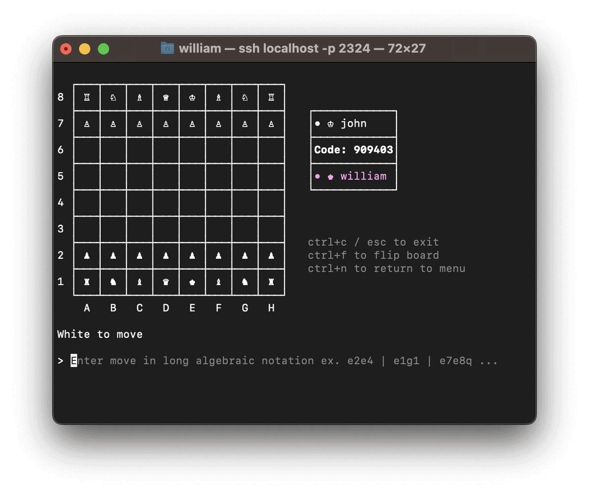
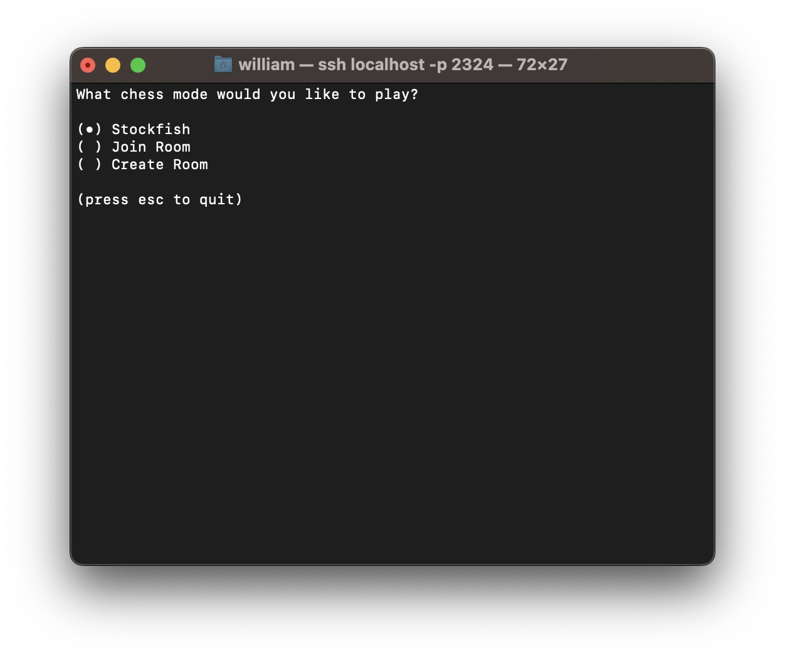
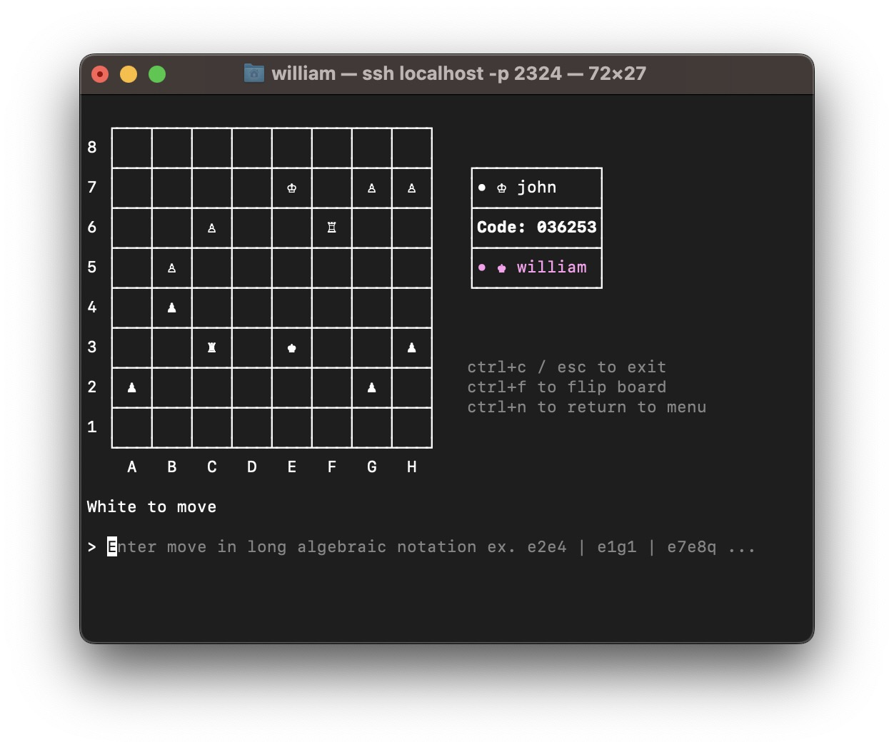
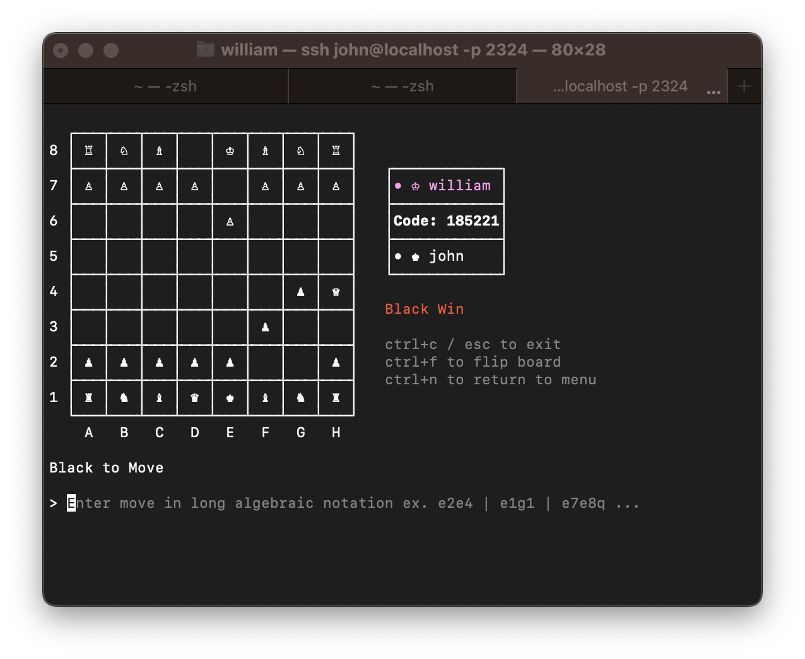

# Terminal Chess
Play chess in your terminal.

### Play
You can play by running:

```
ssh terminalchess.com
```

To move pieces, use [long algebraic notation](https://en.wikipedia.org/wiki/Algebraic_notation_(chess)#:~:text=In%20long%20algebraic%20notation%2C%20also,%22x%22%2C%20e.g.%20Rd3xd7.). e.g. `e2e4`, `e1g1 (castling)`, `e7e8q (promotion)`.

### Images



