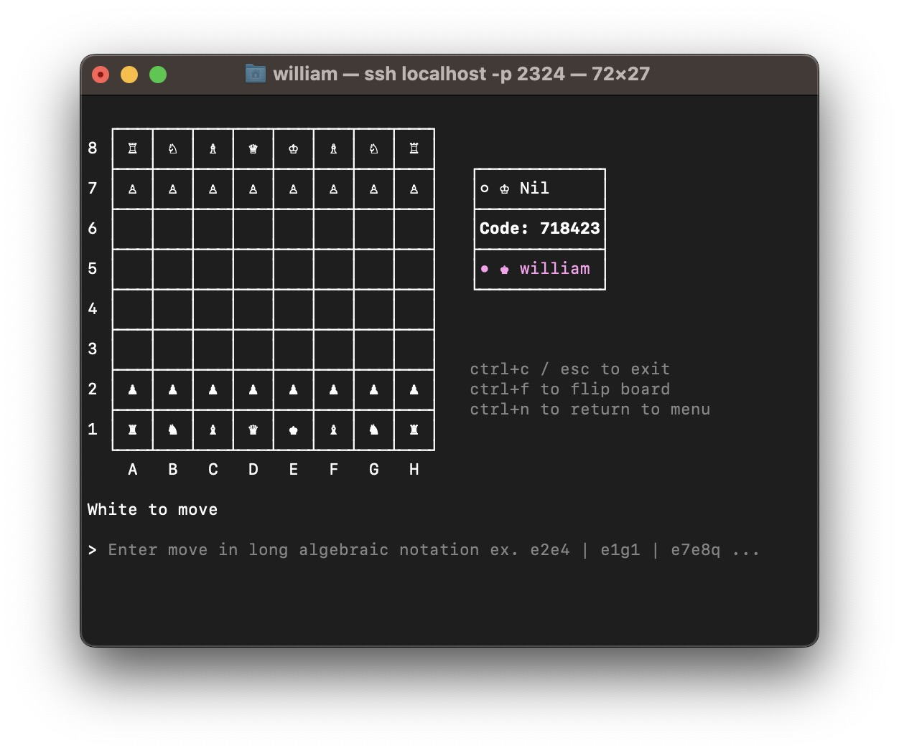

# Terminal Chess
Play chess in your terminal.

### Play
You can play by running:

```sh
ssh terminalchess.com
```

> [!NOTE]
> To move pieces, use [long algebraic notation](https://en.wikipedia.org/wiki/Algebraic_notation_(chess)#:~:text=In%20long%20algebraic%20notation%2C%20also,%22x%22%2C%20e.g.%20Rd3xd7.). e.g. `e2e4`, `e1g1 (castling)`, `e7e8q (promotion)`.


### Images




### Resources
- [generating chess moves](https://peterellisjones.com/posts/generating-legal-chess-moves-efficiently/)
- [magic bitboards](https://analog-hors.github.io/site/magic-bitboards/)
### License
Distributed under MIT License. See [LICENSE](./LICENSE) for more information.